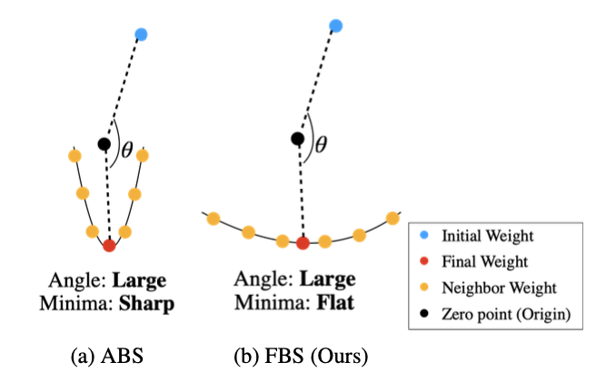
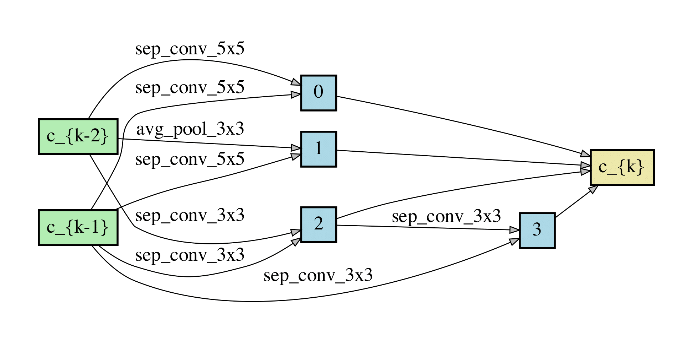
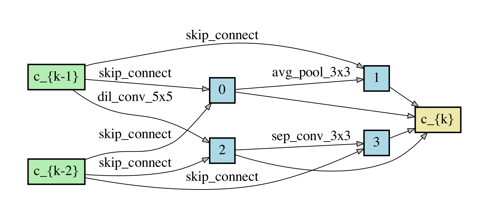
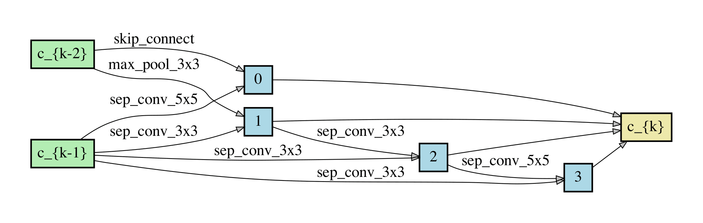
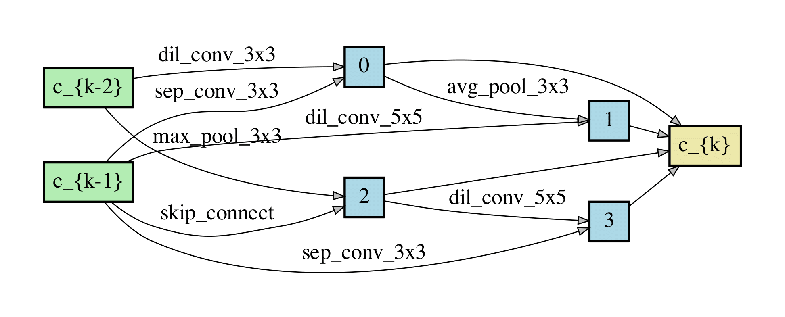
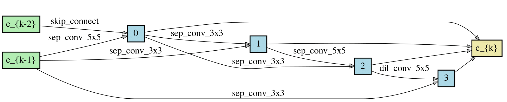
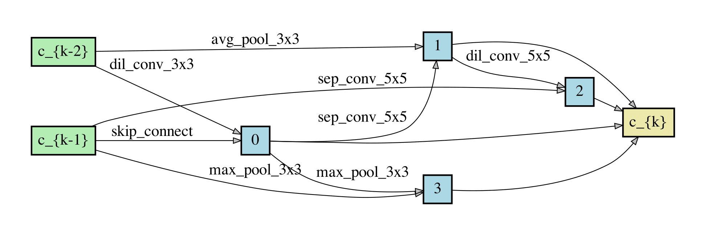

# GeNAS (IJCAI 2023)

**GeNAS: Neural Architecture Search with Better Generalization** <br />

[Joonhyun Jeong](https://bestdeveloper691.github.io/)<sup>1,2</sup>, [Joonsang Yu](https://scholar.google.co.kr/citations?user=IC6M7_IAAAAJ&hl=ko)<sup>1,3</sup>, [Geondo Park](https://scholar.google.com/citations?user=Z8SGJ60AAAAJ&hl=ko)<sup>2</sup>, [Dongyoon Han](https://scholar.google.com/citations?user=jcP7m1QAAAAJ&hl=en)<sup>3</sup>, [YoungJoon Yoo](https://yjyoo3312.github.io/)<sup>1</sup><br>

<sup>1</sup> <sub>NAVER Cloud, ImageVision</sub><br />
<sup>2</sup> <sub>KAIST</sub><br />
<sup>3</sup> <sub>NAVER AI Lab</sub><br />

[](https://ijcai-23.org/)
[](https://arxiv.org/abs/2305.08611)

## Introduction

Neural Architecture Search (NAS) aims to automatically excavate the optimal network architecture with superior test performance. Recent neural architecture search (NAS) approaches rely on validation loss or accuracy to find the superior network for the target data. In this paper, we investigate a new neural architecture search measure for
excavating architectures with better generalization. We demonstrate that the flatness of the loss surface can be a promising proxy for predicting the generalization capability of neural network architectures. We evaluate our proposed method on various search spaces, showing similar or even better performance compared to the state-of-the-art NAS methods. Notably, the resultant architecture found by flatness measure generalizes robustly to various shifts in data distribution (e.g. ImageNet-V2,-A,-O), as well as various tasks such as object detection and semantic segmentation.



## Updates    
**_2023-08-09_** We release the official implementation of GeNAS.

## Requirements

* Pytorch 1.7.1

Please see [requirements](./requirements.txt) for detailed specs.

## Quick Start

1. Train SuperNet, following [SPOS](https://github.com/megvii-model/SinglePathOneShot).

```bash
cd train_supernet
python3 train.py \
        --seed 1 \
        --data [CIFAR_DATASET_DIRECTORY] \
        --epochs 250 \
        --save [OUTPUT_DIRECTORY] \
        --random_label 0 \
        --split_data 1
```

2. Evolutionary Searching

- You can skip step 1 and use [the pretrained SuperNet checkpoints](https://drive.google.com/drive/folders/19TAHE5C66n1PCLaAjcemGfmkIJQNkVKj?usp=sharing).

### Searching with Flatness

```bash
cd evolutionary_search
python3 search.py \
        --split_data 1 \
        --seed 3 \
        --init_model_path [SUPERNET_WEIGHT@INITIAL_EPOCH] \
        --model_path [SUPERNET_WEIGHT@FINAL_EPOCH] \
        --data [CIFAR_DATASET_DIRECTORY] \
        --metric wlm \
        --stds 0.001,0.003,0.006 \
        --max_train_img_size 850 \
        --max_val_img_size 25000 \
        --wlm_weight 0 \
        --acc_weight 0
```

### Searching with Angle + Flatness

```bash
python3 search.py \
        --split_data 1 \
        --seed 3 \
        --init_model_path [SUPERNET_WEIGHT@INITIAL_EPOCH] \
        --model_path [SUPERNET_WEIGHT@FINAL_EPOCH] \
        --data [CIFAR_DATASET_DIRECTORY] \
        --metric angle+wlm \
        --stds 0.001,0.003,0.006 \
        --max_train_img_size 850 \
        --max_val_img_size 25000 \
        --wlm_weight 16 \
        --acc_weight 0
```

3. Re-training on ImageNet 

- We used V100 X 8 gpus for re-training on ImageNet.

### searched on CIFAR-100 with flatness
```bash
python3 retrain.py \
        --data_root [IMAGENET_DATA_DIRECTORY] \
        --auxiliary \
        --arch=GENAS_FLATNESS_CIFAR100 \
        --init_channels 46
```

### searched on CIFAR-100 with angle + flatness
```bash
python3 retrain.py \
        --data_root [IMAGENET_DATA_DIRECTORY] \
        --auxiliary \
        --arch=GENAS_ANGLE_FLATNESS_CIFAR100 \
        --init_channels 48
```

### searched on CIFAR-10 with flatness
```bash
python3 retrain.py \
        --data_root [IMAGENET_DATA_DIRECTORY] \
        --auxiliary \
        --arch=GENAS_FLATNESS_CIFAR10 \
        --init_channels 52
```

### searched on CIFAR-10 with angle + flatness
```bash
python3 retrain.py \
        --data_root [IMAGENET_DATA_DIRECTORY] \
        --auxiliary \
        --arch=GENAS_ANGLE_FLATNESS_CIFAR10 \
        --init_channels 44
```

## Model Zoo

|   Search Dataset   |  Search Metric   |    Params (M)   |  FLOPs (G) | ImageNet Top-1 Acc (%) | Weight |
| :--------: | :----------------: | :-----------------: | :--------------:  | :------:  | :------:  |
CIFAR-10 | Angle | 5.3 | 0.6 | 75.7 | [ckpt](https://drive.google.com/file/d/1J_xyxU3ZbuDDr1ASEjdUIkjnrf5rNqB_/view?usp=sharing)
CIFAR-10 | Accuracy | 5.4 | 0.6 | 75.3 | [ckpt](https://drive.google.com/file/d/1jo76ZhbqJt11qls3q2rMVsUcfzkQWp1Q/view?usp=sharing)
CIFAR-10 | Flatness | 5.6 | 0.6 | 76.0 | [ckpt](https://drive.google.com/file/d/1VamhvAUSi2XZVE0Vn4Lxxp1S_dqODTil/view?usp=sharing)
CIFAR-10 | Angle + Flatness | 5.3 | 0.6 | 76.1 | [ckpt](https://drive.google.com/file/d/1p2PSkt5ZyFY2NLGgU45Ilr5NIaXNizW9/view?usp=sharing)
CIFAR-10 | Accuracy + Flatness | 5.6 | 0.6 | 75.7 | [ckpt](https://drive.google.com/file/d/1QBEyY-vFYpGOlwRSsTFxMM8GBtY3F8k7/view?usp=sharing)
| | | | | 
CIFAR-100 | Angle | 5.4 | 0.6 | 75.0 | [ckpt](https://drive.google.com/file/d/1CmpkPsWNWVdbDbcmyuVfp38A7lB2MWoC/view?usp=sharing)
CIFAR-100 | Accuracy | 5.4 | 0.6 | 75.4 | [ckpt](https://drive.google.com/file/d/1TWzs-upwnAgOvF0HjKDSwC3TeDRstl4C/view?usp=sharing)
CIFAR-100 | Flatness | 5.2 | 0.6 | 76.1 | [ckpt](https://drive.google.com/file/d/1YLcZNpTytP9XTYDYoQ_nv8gQHnRAFe67/view?usp=sharing)
CIFAR-100 | Angle + Flatness | 5.4 | 0.6 | 75.7 | [ckpt](https://drive.google.com/file/d/1reRbr4cFeoL8fwOTPQjQTg7w_QZAAIm4/view?usp=sharing)
CIFAR-100 | Accuracy + Flatness | 5.4 | 0.6 | 75.9 | [ckpt](https://drive.google.com/file/d/1-GVpP7yUWc7W6Qf8dM_FN3fTo0acO0AI/view?usp=sharing)

### Architecture Visualization

#### angle-based searching

- normal cell



- reduce cell




#### angle+flatness based searching

- normal cell



- reduce cell



#### flatness-based searching

- normal cell



- reduce cell



## Citation
If you find that this project helps your research, please consider citing as below:

```
@article{jeong2023genas,
  title={GeNAS: Neural Architecture Search with Better Generalization},
  author={Jeong, Joonhyun and Yu, Joonsang and Park, Geondo and Han, Dongyoon and Yoo, Youngjoon},
  journal={arXiv preprint arXiv:2305.08611},
  year={2023}
}
```

## License
```
GeNAS
Copyright (c) 2023-present NAVER Cloud Corp.

Permission is hereby granted, free of charge, to any person obtaining a copy
of this software and associated documentation files (the "Software"), to deal
in the Software without restriction, including without limitation the rights
to use, copy, modify, merge, publish, distribute, sublicense, and/or sell
copies of the Software, and to permit persons to whom the Software is
furnished to do so, subject to the following conditions:

The above copyright notice and this permission notice shall be included in
all copies or substantial portions of the Software.

THE SOFTWARE IS PROVIDED "AS IS", WITHOUT WARRANTY OF ANY KIND, EXPRESS OR
IMPLIED, INCLUDING BUT NOT LIMITED TO THE WARRANTIES OF MERCHANTABILITY,
FITNESS FOR A PARTICULAR PURPOSE AND NONINFRINGEMENT.  IN NO EVENT SHALL THE
AUTHORS OR COPYRIGHT HOLDERS BE LIABLE FOR ANY CLAIM, DAMAGES OR OTHER
LIABILITY, WHETHER IN AN ACTION OF CONTRACT, TORT OR OTHERWISE, ARISING FROM,
OUT OF OR IN CONNECTION WITH THE SOFTWARE OR THE USE OR OTHER DEALINGS IN
THE SOFTWARE.
```
